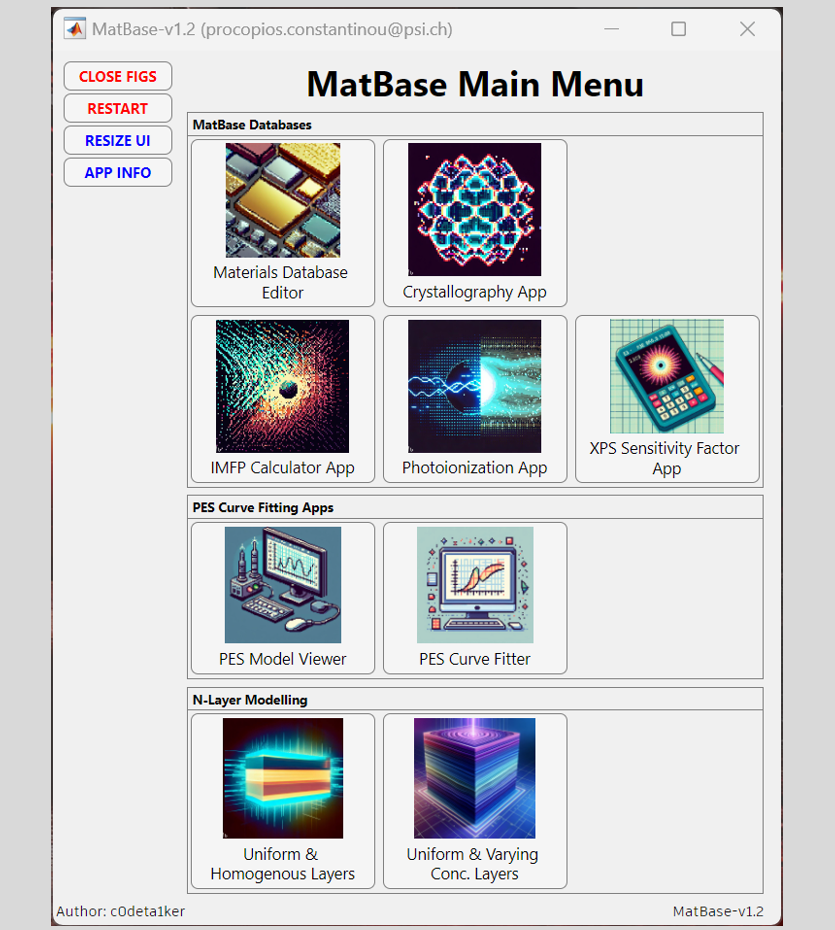
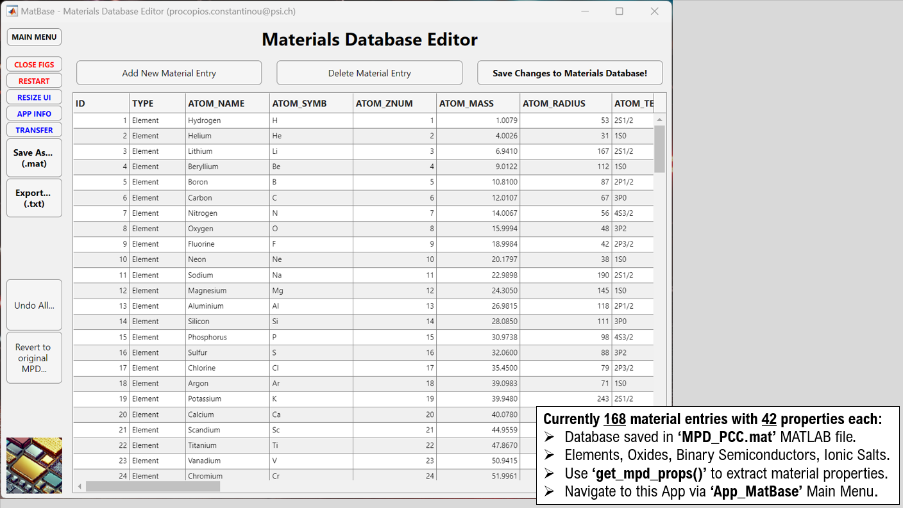
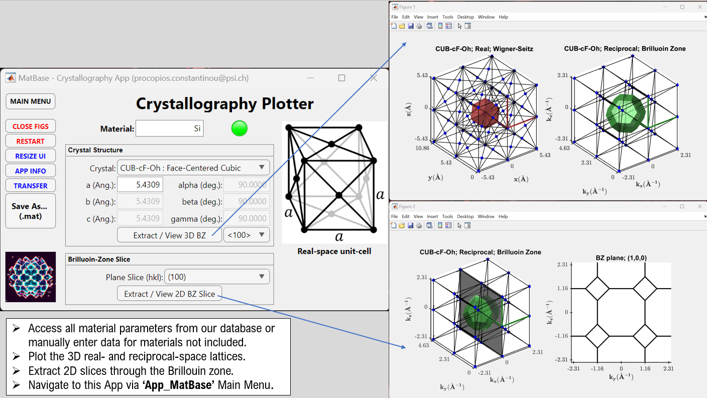
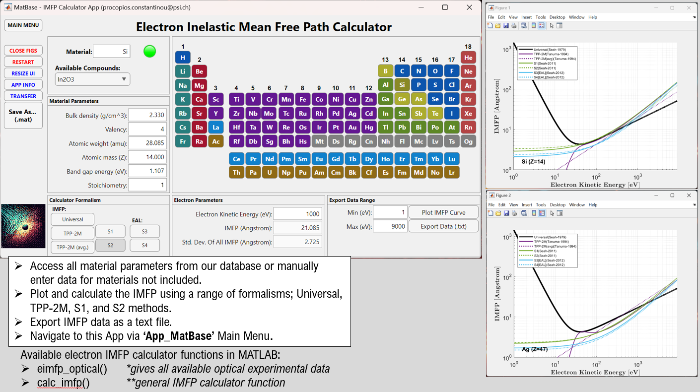
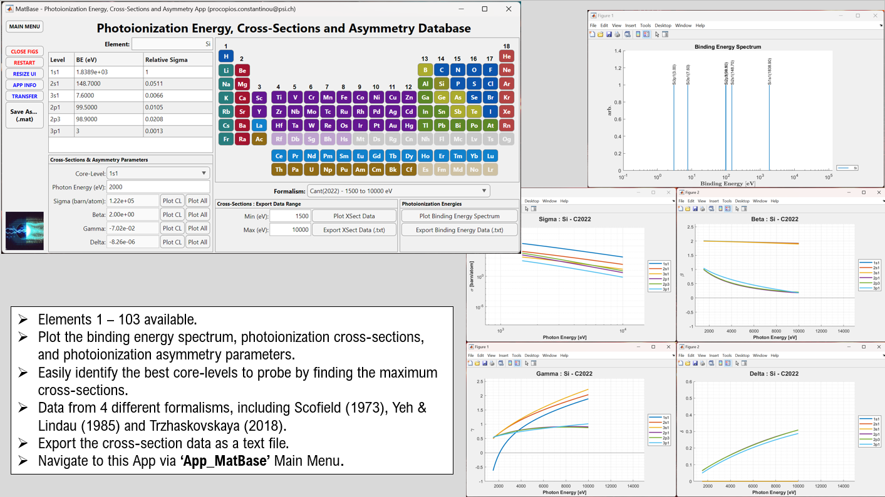
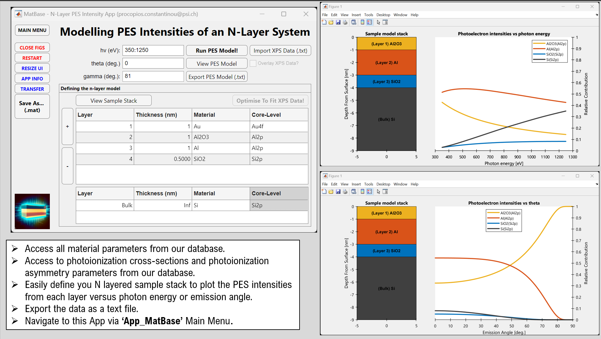

# MatBase: A comprehensive MATerials DataBASE for photoelectron spectroscopy analysis

[MatBase](https://github.com/c0deta1ker/MatBase) is an app that allows you to explore, analyze and extract the properties and photoelectron spectroscopy behaviors of various materials using MATLAB. You can use this app to:  
- Access and edit a comprehensive database of material properties and photoelectron spectroscopy parameters.  
- Visualize and manipulate crystal structures in both real and reciprocal space, and calculate the Brillouin zone and 2D slices.  
- Compute the electron inelastic mean free path for different materials using various formalisms, such as the Universal, TPP-2M, S1, S2, and JTP methods.  
- Extract the binding energy spectrum, photoionization cross-sections, and photoionization asymmetry parameters for all elements from 1 to 118.  
- Model an N-layer sample stack to determine the PES intensity contribution from each layer.  
- Curve fit XPS or PES data using an intuitive user interface, with support for up to 10 curves, various curve shapes (Gaussian, Lorentzian, and Voigt), background subtraction methods (Polynomial, Shirley, and Tougaard), and parameter constraints.  

This app is designed for researchers, students, and enthusiasts who are interested in learning more about the physical and chemical properties of materials. Whether you are working on a project, studying for an exam, or just curious about the world of materials science and photoelectron spectroscopy, this app can help you find the information and tools you need. Download [MatBase](https://github.com/c0deta1ker/MatBase) today and discover the fascinating world of materials science!  

## Installation  
1. Download the *MatBase* repository.
2. Open MATLAB and use *Set Path* in the *Home* tab to add the *MatBase* repository and all its sub-folders into its saved search paths.
3. Make sure you also use *Set Path* to add the repository / folder that contains all of your data to be loaded in.
4. Type 'App_MatBase' in the MATLAB Command Prompt to boot up the Main Menu App.

## MatBase Apps
**(1) MatBase Main Menu**: The main MATLAB App that provides seamless navigation to all other MATLAB apps using the comprehensive Materials Properties Database. Accessible in MATLAB via 'App_MatBase'.
  

**(2) Materials Database Editor App**: Effortlessly manage the Materials Properties Database with this user-friendly app. Add, delete, and edit entries with ease, streamlining your workflow and enhancing the efficiency of other apps that utilize the database for calculations. Accessible in MATLAB via the MatBase Main Menu, or explicitely by typing 'App_MatBase_DatabaseEditor'.
  

**(3) Crystallography App**: Explore the intricacies of crystal structures with our powerful visualization app. View unit cells in both real and reciprocal space, calculate the Brillouin zone, and extract 2D slices for in-depth analysis. Conveniently access material parameters from the Materials Properties Database or manually enter data for materials not included in the database. Unlock new insights and enhance your understanding of crystal structures with ease! Accessible in MATLAB via the MatBase Main Menu, or explicitely by typing 'App_MatBase_Crystallography'.
  

**(4) IMFP Calculator App**: Achieve unparalleled precision in your calculations of electron inelastic mean free path with our advanced app. Utilize a range of formalisms, including the Universal, TPP-2M, S1, S2 and JTP methods, to achieve the most accurate results. Conveniently access material parameters from the Materials Properties Database or manually enter data for materials not included in the database. Enhance your workflow and achieve new levels of accuracy with ease! Accessible in MATLAB via the MatBase Main Menu, or explicitely by typing 'App_MatBase_IMFP'.
  

**(5) Photoionization Database App**: Extract the binding energy spectrum, photoionization cross-sections, and photoionization asymmetry parameters of all elements between 1-118 with our powerful app. Easily identify the best core-levels to probe by finding the maximum cross-sections and gain a comprehensive overview of the core-level spectra of all elements! Accessible in MATLAB via the MatBase Main Menu, or explicitely by typing 'App_MatBase_Photoionization'.
  

**(6) N-Layer PES Intensity Model App**: Create a sample stack of N layers with different materials and thicknesses from the Materials Properties Database. Then, use the Photoionisation Cross-Section and Asymmetry Database to get the core-levels, cross-sections, and asymmetry parameters for each layer. The PES intensities for each layer are then determined using the Beer-Lambert law, modulated by the electron inelastic mean free path calculated using the JTP formalism whilst considering the experimental geometry. This will help you compare XPS depth profile data (spectral intensity versus photon energy or emission angle), and determine the layer thicknesses in your samples from XPS! Accessible in MATLAB via the MatBase Main Menu, or explicitely by typing 'App_MatBase_NLayerPESIntensities'.  
  

**(7) PES Curve Fitting App**: Easily load your XPS data from a standard .txt file and construct a series of curves, including principal and spin-orbit split components. Begin by developing an initial model (using Gaussian, Lorentzian, Voigt and Doniach-Sunjic Peak Shapes), applying background subtraction (Polynomial, Shirley, and Tougaard) and setting constraints, an optimization algorithm is then run to achieve the best fit. Accessible in MATLAB via the MatBase Main Menu, or explicitely by typing 'App_MatBase_PESCurveFitter'.  
  

## List of Available Databases  
- **Material Properties Database (MPD)**: This is a local MATLAB database that compiles the most useful physical, electronic, optical and magnetic material properties of elements / compounds. The data is taken from a range of sources, where the 'average' values are used for parameters that had more than 1 unique value. Accessible in MATLAB via 'get_mpd_props()'.  

- **Physics Constants Database**: This is a MATLAB function that loads in many physics constants that can be used for data processing, or modelling of physical systems. Accessible in MATLAB via 'physics_constants()'.  

- **Crystallography Database**: Contains some MATLAB functions for extracting / viewing the unit cells in both real and reciprocal space, calculate the Brillouin zone, and extract 2D slices through the Brilluoin Zone for data analysis. You can translate and rotate the 2D slices as you wish. For some examples of how to use these functions, see the ‘CrystallographyExamples.mlx’ file.  

- **Electron Inelastic Mean Free Path Database (eIMFPD)**: This is a local MATLAB database that compiles the optical data from the NIST Electron Inelastic-Mean-Free-Path Database (http://dx.doi.org/10.18434/T48C78) so that the results can be easily called and accessed within MATLAB. This is accessible in MATLAB via 'get_eimfpd_props()'. Furthermore, predictive eIMFP formulas's are also available using the (1) Universal, (2) TPP-2M and (3) S1 & S2 formalisms.  

- **Photoionisation Cross-Section and Asymmetry Database (PIXSAD)**: This is a local MATLAB database that compiles the photoionisation cross-section and asymmetry parameter data of the elements. This is useful when modelling the total photoelectron intensity that originates from a given layer of a sample when performing ARPES / XPS experiments. Accessible in MATLAB via 'get_pixsad_props()'.   

- **Photoionisation Energy and Fluorescence Database (PIEFD)**: This is a local MATLAB database that compiles the photoionisation energy and fluorescence yield data of the elements. Accessible in MATLAB via 'get_piefd_props()'.    

- **PES Quantification, Modelling & Fitting**: A powerful toolbox of functions for handling photoelectron spectroscopy (PES) data. Inside, you’ll find functions for data processing, compositional analysis, overlayer thickness determination, sensitivity factor determination and curve fitting using various models. A suite of functions are also available, from Peak-Like Models (Gaussian, Lorentzian, Voigt, Doniach-Sunjic & Pseudo-Voigt) to TopHat- and Step-Like functions for plotting atomic concentration curves.

## MATLAB Version control  
MATLAB version:   2024a  
MATLAB add-ons (recommended): Database Toolbox, Image Processing Toolbox.

## Authors
**Dr. Procopios Constantinou**,  
Swiss Light Source (SLS),  
Paul Scherrer Institute (PSI),  
email: procopios.constantinou@psi.ch

## Acknowledgments  

## References

** Inelastic Mean-Free Path (IMFP) Sources **
Universal (1979):    
[1](http://dx.doi.org/10.18434/T48C78) _Seah, M. Pl, and W. A. Dench. "Quantitative electron spectroscopy of surfaces: A standard data base for electron inelastic mean free paths in solids." Surface and interface analysis 1.1 (1979): 2-11_  

TPP-2M Formalism (1994):      
[2](https://doi.org/10.1002/sia.740010103) _Tanuma, Shigeo, Cedric J. Powell, and David R. Penn. "Calculations of electron inelastic mean free paths. V. Data for 14 organic compounds over the 50–2000 eV range." Surface and interface analysis 21.3 (1994): 165-176_  
[3](https://doi.org/10.1002/sia.1526) _Tanuma, Shigeo, Cedric J. Powell, and David R. Penn. "Calculation of electron inelastic mean free paths (IMFPs) VII. Reliability of the TPP‐2M IMFP predictive equation." Surface and interface analysis 35.3 (2003): 268-275_    
[4](https://doi.org/10.1002/sia.4816) _Seah, M. P. "An accurate and simple universal curve for the energy‐dependent electron inelastic mean free path." Surface and interface analysis 44.4 (2012): 497-503_    
[5](https://doi.org/10.1002/sia.3522) _Tanuma, Shigeo, C. J. Powell, and D. R. Penn. "Calculations of electron inelastic mean free paths. IX. Data for 41 elemental solids over the 50 eV to 30 keV range." Surface and interface analysis 43.3 (2011): 689-713_    

NIST Electron Inelastic-Mean-Free-Path Database (1999):     
[6] [NIST](http://dx.doi.org/10.18434/T48C78) Optical Experiment Data  

S1 & S2 Formalism (2011):     
[4](https://doi.org/10.1002/sia.4816) _Seah, M. P. "An accurate and simple universal curve for the energy‐dependent electron inelastic mean free path." Surface and interface analysis 44.4 (2012): 497-503_    

S3 & S4 Formalism (2012):    
[7](https://doi.org/10.1002/sia.5033) _Seah, M. P. "Simple universal curve for the energy‐dependent electron attenuation length for all materials." Surface and interface analysis 44.10 (2012): 1353-1359_   

JTP Formalism (2023):    
[8](https://doi.org/10.1002/sia.7217) _Jablonski, Aleksander, Shigeo Tanuma, and Cedric J. Powell. "Calculations of electron inelastic mean free paths (IMFPs). XIV. Calculated IMFPs for LiF and Si3N4 and development of an improved predictive IMFP formula." Surface and Interface Analysis 55.8 (2023): 609-637_   

** Photoionization Energies, Cross-Sections & Asymmetry Sources **  
Scofield Database (1973):  
[9](https://doi.org/10.2172/4545040) _Scofield, J. H. "Theoretical photoionization cross sections from 1 to 1500 keV"_   

Yeh & Lindau Database (1985):   
[[10](https://doi.org/10.1016/0092-640X(85)90016-6)] _Yeh, J. J., and I. Lindau. "Atomic subshell photoionization cross sections and asymmetry parameters: 1⩽ Z⩽ 103." Atomic data and nuclear data tables 32.1 (1985): 1-155_   

Moulder Binding Energies Database (1993): 
[11](https://scholar.google.com/scholar_url?url=https://www.researchgate.net/profile/Akif-Zeb/post/How_can_I_evaluate_at_of_N_in_TiO2_using_XPS_technique/attachment/5f3ebac4ce377e00016e3bc5/AS%253A926669195993088%25401597946561045/download/MANXPS.pdf&hl=en&sa=T&oi=gsb-ggp&ct=res&cd=0&d=11053645406167494942&ei=Aw3XZr_mFv-Xy9YPgcCeoQo&scisig=AFWwaeajp-vE3wtFLu1NvP33L_uI) _Moulder, John F. et al. “Handbook of X-Ray Photoelectron Spectroscopy.” (1992)._   

Trzhaskovskaya Database (2018-2019):   
[12](https://doi.org/10.1016/j.adt.2017.04.003) _Trzhaskovskaya, M. B., and V. G. Yarzhemsky. "Dirac–Fock photoionization parameters for HAXPES applications." Atomic Data and Nuclear Data Tables 119 (2018): 99-174._   
[13](https://doi.org/10.1016/j.adt.2019.05.001) _Trzhaskovskaya, M. B., and V. G. Yarzhemsky. "Dirac–Fock photoionization parameters for HAXPES applications, Part II: Inner atomic shells." Atomic Data and Nuclear Data Tables 129 (2019): 101280_   

Cant Database (2018-2019):   
[14](https://doi.org/10.1002/sia.7059) _Cant, David JH, et al. "Quantification of hard X‐ray photoelectron spectroscopy: Calculating relative sensitivity factors for 1.5‐to 10‐keV photons in any instrument geometry." Surface and Interface Analysis 54.4 (2022): 442-454_   

** Materials Properties Database Sources **  
[15](https://www.wolframalpha.com/) _Electronegativity, electron affinity, ionisation energies, temperatures and crystal structures_   
[16](https://www.schoolmykids.com/learn/periodic-table-of-elements/) _Temperatures, crystal structures, unit cell parameters, electronic and magnetic properties_   
[17](https://doi.org/10.1063/1.3253115/) _Strehlow, W. H., and Earl L. Cook. "Compilation of energy band gaps in elemental and binary compound semiconductors and insulators." (1973): 163-200._   
[18](https://en.wikipedia.org/) _Band-gap estimates,  temperatures,  crystal structures,  unit cell parameters,  electronic and magnetic properties_   
[19](https://pubchem.ncbi.nlm.nih.gov/) _Atomic weights of elements and compounds_   

** Useful PES Quantification Literature **  
[20](https://doi.org/10.1016/0009-2614(76)80496-4) _Hill, J. M., et al. "Properties of oxidized silicon as determined by angular-dependent X-ray photoelectron spectroscopy." Chemical Physics Letters 44.2 (1976): 225-231_   
[21](https://doi.org/10.1002/sia.5934) _Walton, J., et al. "Film thickness measurement and contamination layer correction for quantitative XPS." Surface and Interface Analysis 48.3 (2016): 164-172_   
[22](https://doi.org/10.1116/1.5141395) _Shard, Alexander G. "Practical guides for x-ray photoelectron spectroscopy: Quantitative XPS." Journal of Vacuum Science & Technology A 38.4 (2020)_   

** Useful Websites for XPS Information & Application Notes **    
[23](https://srdata.nist.gov/xps/) NIST X-ray Photoelectron Spectroscopy Database  
[24](https://www.xpsfitting.com/search/label/About%20This%20Site) Surface Science Western laboratories (XPS Reference Pages)  
[25](https://xpsdatabase.net/) B. Vincent Crist: International XPS Database  
[26](https://xpslibrary.com/) B. Vincent Crist: Information and Application Notes  
[27](https://www.xpsdata.com/xpsdata.htm) Information and Application Notes  

## License  
This project is licensed under the GNU General Public License v3.0 - see the [LICENSE.md](LICENSE.md) file for details.

--PCC, September 2024